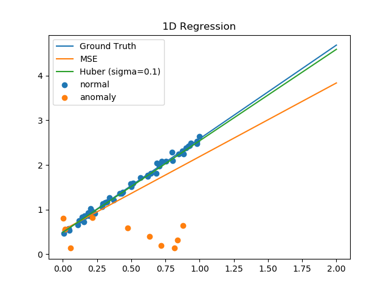

# Robust Regression with Huber loss
This is a toy example of robust regreesion with huber loss, which is suitable 
when training samples have outliers. The ground truth is a simple line. The results
below show that huber loss could get rid of the outliers.

